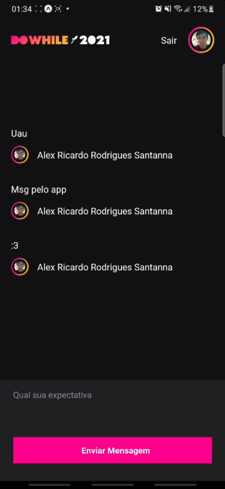

<h1 align="center">Front-end APP da Aplicação em Nodejs / By Alex, Rocketseat</h1>

  <a href="#-tecnologias">Tecnologias</a>&nbsp;&nbsp;&nbsp;|&nbsp;&nbsp;&nbsp;
  <a href="#-como-executar">Como executar</a>

## ✨ Tecnologias

Esse projeto foi desenvolvido com as seguintes tecnologias:

- [TypeScript](https://www.typescriptlang.org/)
- React-native
- Expo
- [Socket.IO](https://socket.io/)

## 🚀 Como executar

> Obs.: Nesse projeto temos autenticação via OAuth com o GitHub

- Clone o [repositório](https://github.com/alexRicc2/NLW) do Backend da aplicação e siga seus passos de execução ;

- Instale as dependências com `yarn`;

- Inicie o projeto com `expo start`;

A aplicação pode ser acessada por seu smarthphone ao escanear o QRcode

- [Repositorio](https://github.com/alexRicc2/NLW) da aplicação backend

O front deu um Trabalhin mas foi, to feliz 10/27/2021
